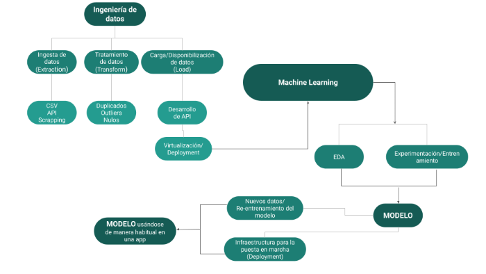
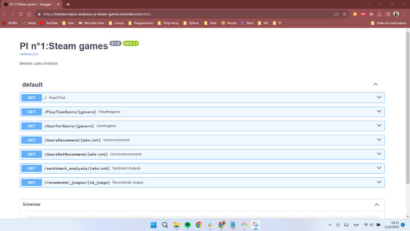

<h1 align="center"> Proyecto Individual: FastAPI Steam_games  </h1>

## Descripción del proyecto

- Proyecto realizado en el marco de la carrera de Data Science de SoyHenry.  
- En el siguiente proyecto de Machine Learning Operations se realiza un procedimiento completo desde el tratamiento y recolección de los datos hasta el entrenamiento y mantenimiento del modelo de ML como si fueramos Data Scientists de Steam.
- El proyecto en su totalidad puede encontrar en [Github del proyecto](https://github.com/Betilopeza/PI-Steam_Games)

 

  

 

## Objetivo
Considerando que somos Data Scientists en Steam, una plataforma multinacional de videojuegos, el objetivo es crear un primer modelo de ML que soluciona un problema de negocio: crear un sistema de recomendación de videojuegos para usuarios. 

Se debe realizar un trabajo rápido de Data Engineer para obtener un MVP (Minimum Viable Product), es decir, una API (Application Programming Interface) que pueda ser consumida desde cualquier dispositivo.

 

  

 

## Datasets

El equipo de SoyHenry proporcionó los datasets necesarios para este proyecto.
- Los datos están conformados por 3 archivos json.gz comprimidos: steam_games.json.gz, user_reviews.json.gz y users_items.json.gz.
- Como una manera de simplificar la carga y manipulación de los archivos en VS  se decide descomprimir los archivos de manera previa a su utilización, quedando los 3 archivos descomprimidos: output_steam_games.json, austrlian_user_reviews.json y australian_users_items.json.
- Debido a recursos limitados, no se presentan estos archivos en github, pero tienen acceso a ellos en [Google drive](
https://drive.google.com/drive/folders/1faBm09wDSvC80MJg2WhCg40QFohnY4PC?usp=drive_link)

 

## ETL

Se decide realizar el procedimiento de ETL por separado para cada json en un archivo diferente: [01_ETL_games.ipynb](01_ETL_games.ipynb), [02_ETL_reviews.ipynb](02_ETL_reviews.ipynb) y [03_ETL_items.ipynb](03_ETL_items.ipynb).
De cada uno se obtiene un dataframe diferente: df_games, df_reviews y df_items.  

El procedimiento de ETL siguió los siguientes pasos: 

- Se cargaron los datos haciendo uso de la librería pandas.
- El archivo output_steam_games.json contenía en la parte superior la información correspondiente al archivo australian_users_items, por lo que se decidió eliminar esos datos del primer archivo. 
- En cada uno de los archivos fue necesario hacer uso de los comandos explode y/o json_normalize de manera de poder desanidar listas y json anidados dentro de una columna (en df_games había listas anidadas, en df_reviews y df_items había json anidados)
- Se eliminaron las columnas que no fueran necesarias para la consultas. 
- Se eliminaron valores nulos cuando los datos pertenecían a una columna que formaban parte de las consultas (por ejemplo year_review, review, entre otras). Esto fue necesario para poder optimizar el rendimiento de las funciones en la API.
- Cuando fue posible, se utilizaron los URL para completar alguna información faltante, sobre todo en la parte de los juegos. Por ejemplo: ids faltantes o títulos de juegos faltantes.
- Cuando fue necesario se modificaron tipos de datos a enteros, a datetime, entre otros.
- Se realizó un análisis de sentimiento NLP (Procesamiento de Lenguaje Natural) en el archivo correspondiente al ETL de las reviews, donde se analizaron las reviews de los usuarios para clasificar los comentarios como positivos, neutros o negativos.
- En el modelo de Machine Learning, se crearon dummies de valores binarios para optimizar la carga de las consultas. Se tuvieron en cuenta algunos criterios que permitieron simplificar los datos y optimizar la consulta en la API: se consideraron los top 100 juegos más jugados y los géneros con más items.  

 

## FASTAPI

- En el archivo [04_tratamiento_para_funciones.ipynb](04_tratamiento_para_funciones.ipynb) se hizo, a partir de los dataframes: df_games, df_reviews, df_items, el tratamiento de los datasets para las funciones, que incluye merge entre los distintos datasets, agrupamiento de los datos, filtrado, etc. 
- En el archivo [05_Funciones.ipynb](05_Funciones.ipynb) se prueban las funciones que se van a presentar en el [main.py](./main.py). Se importan los datos, y se demuestra el funcionamiento de los datos en local. 
- Se trabajo en un entorno virtual de Python, se creó el archivo [main.py](./main.py) donde utilizando el framework FastAPI se crearon las funciones que luego observaremos en el render.

 

Las funciones solicitadas fueron:

**def PlayTimeGenre( genero : str )**
Se ingresa un género en formato string y debe devolver el año con mas horas jugadas para dicho género.

**def UserForGenre( genero : str )** 
Se ingresa un género en formato string y debe devolver el usuario que acumula más horas jugadas para el género dado y una lista de la acumulación de horas jugadas por año.

**def UsersRecommend( año : int )** 
Se ingresa un año en formato int y devuelve el top 3 de juegos MÁS recomendados por usuarios para el año dado. (reviews.recommend = True y comentarios positivos/neutrales)

**def UsersNotRecommend( año : int )** 
Se ingresa un año en formato int y devuelve el top 3 de juegos MENOS recomendados por usuarios para el año dado. (reviews.recommend = False y comentarios negativos)

**def sentiment_analysis( año : int )** 
Se ingresa el año de lanzamiento y devuelve una lista con la cantidad de registros de reseñas de usuarios que se encuentren categorizados con un análisis de sentimiento.

**def recomendar_juegos(id_juego: int)**
Se ingresa el id del juego, debe devolver una lista con 5 juegos recomendados similares al ingresado.

 

**NOTA**: En la mayoría de los casos, se importaron los datos en .csv, salvo en el caso de la función UserForGenre que al no poder simplificarse más, se decide guardar en parquet. Este proceso se realizó por falta de espacio en github pero también para facilitar el procedimiento de la API.

 

## ANÁLISIS EXPLORATORIO DE LOS DATOS

- El Análisis Exploratorio de Datos (EDA) se encuentra en el siguiente archivo [06_EDA_Modelo_ML.ipynb](06_EDA_Modelo_ML.ipynb)
- Se hace por un lado un análisis exploratorio de los datos correspondientes a juegos e items y por otro lado un análisis de las reviews.
- En lo que refiere al análisis de juegos e items, analizamos el crecimiento de la empresa en función de los lanzamientos de juegos por años, se analizan las horas de juego por género, el número de juegos por género y las horas de juego por item.
- Tanto el número de juegos por género como las horas de juego por item nos ayudarán en la toma de decisiones de algunos criterios de nuestro modelo de ML, sobre todo para su implementación en la API.
- En lo que refiere al análisis de las reviews, podemos análizar en función a los datos, que las recomendaciones son casi en un 90% positivas y el sentimiento detectado por el análisis de sentimiento de las reviews es 57% positivo.
- Nuestro análisis exploratorio se basó principalmente en los datos que ibamos a utilizar para implementar nuestro modelo de ML

 

## SISTEMA DE RECOMENDACIÓN

- Se procede a preparar un sistema de recomendación basándonos en la similitud del coseno. 
- Se arma una matriz donde las filas son los títulos de los juegos (también se presentan los id, ya que ingresamos el id del juego) y en las columnas podemos observar los géneros.
- Pensando en la optimización de la función en la API, se tuvieron en cuenta algunos criterios que permitieron simplificar los datos y optimizar la consulta en la API: se consideraron los top 100 juegos más jugados y los géneros con más items.
- Una vez con el dataset listo, y utilizando la libreria **Scikit-learn** se procedió a utilizar un algoritmo de cosine similarity y obtener los resultados. 
Esto se puede ver en la API en el último endpoint

El archivo correspondiente al código para el sistema de recomendación en el siguiente archivo [06_EDA_Modelo_ML.ipynb](06_EDA_Modelo_ML.ipynb)

 

## DEPLOYMENT

- Se crea el archivo [requirements.txt](requirements.txt) con los requerimientos del entorno virtual de donde Render toma los requerimientos necesarios para que funcione nuestra API. 
- Se verifican las versiones de cada librería instalada, para verificar que sea soportada por render.
- Una vez completados los requerimientos, verificamos el correcto funcionamiento de la API.

 

  

 

## ENLACES DE INTERÉS

Enlace al [Github del proyecto](https://github.com/Betilopeza/PI-Steam_Games)
 
Enlace al [Web Service de Render](https://betiana-lopez-andueza-pi-steam-games.onrender.com/docs)
 
Enlace al [Video de presentación del proyecto](https://drive.google.com/drive/folders/1faBm09wDSvC80MJg2WhCg40QFohnY4PC?usp=drive_link)

